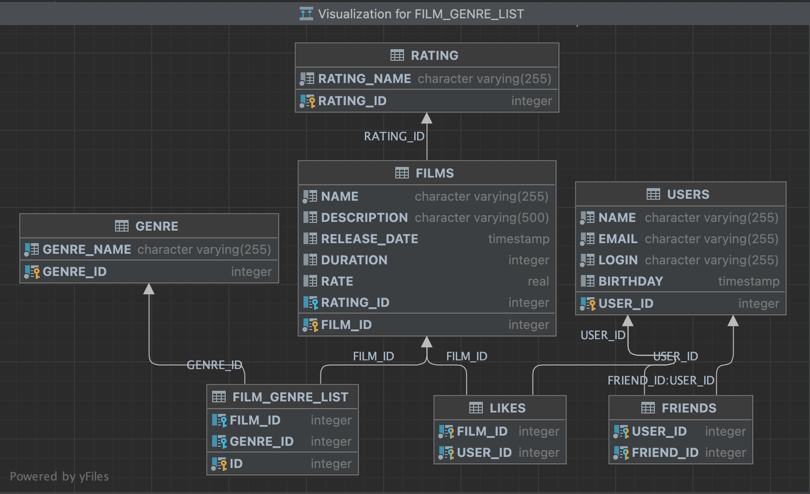

# java-filmorate
Репозиторий шаблонов для проекта Filmorate.


## Схема БД и примеры запросов
<a>

</a>

* получение списка всех пользователей
```SQL
SELECT *
FROM users
```
* добавление в друзья
```SQL
INSERT IGNORE INTO friends (user_id, friend_id)
VALUES (?, ?)
```
* лайк фильму
```SQL
INSERT IGNORE INTO likes (film_id, user_id)
VALUES (?, ?)
```
